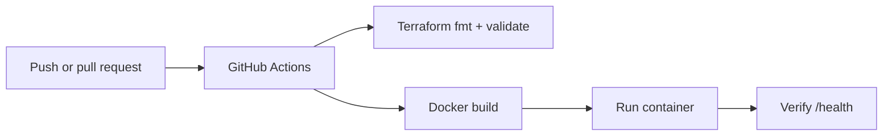

# AWS Terraform Infrastructure

A hands-on AWS delivery project combining Terraform, Docker, GitHub Actions and a small Python service.

> **Portfolio status:** The infrastructure and delivery workflows were deployed and validated in a real AWS learning account during its Free Tier period. That account was intentionally retired after the projects were completed to avoid maintaining unused resources and credentials. The repository now runs reproducible CI checks without requiring a live AWS account.

## What is implemented

| Area | Current evidence |
|---|---|
| Reusable infrastructure | Secure S3 module with documented inputs, outputs and security defaults |
| Secure storage baseline | Bucket versioning, public-access blocking and Bucket Owner Enforced ownership |
| Environment composition | Canonical configuration plus a separate development example |
| Portable state configuration | Partial S3 backend plus a sanitized backend configuration example |
| Terraform CI | Formatting, initialization without a backend and validation on pushes and pull requests |
| Container CI | Docker image build, container startup and live `/health` verification |
| Historical AWS delivery | Successful Terraform apply, GitHub OIDC and Amazon ECR workflow runs retained as evidence |

## Current CI flow



No active workflow assumes an AWS role, changes cloud resources or requires stored cloud credentials.

## Historically validated AWS delivery

During the active AWS phase, the project successfully demonstrated:

- GitHub Actions authentication through OIDC and short-lived IAM-role credentials
- Terraform formatting, initialization, validation, planning and apply
- S3 remote state with native lockfile support
- Docker image publication to Amazon ECR
- environment and immutable commit-SHA image tags

The successful workflow links and retirement rationale are recorded in [Historical AWS Deployment Validation](docs/historical-aws-validation.md).

## Repository structure

```text
.github/workflows/     Active Terraform and Docker portfolio CI
terraform/             Portable canonical AWS configuration
modules/               Reusable secure S3 module
environments/dev/      Development-environment module composition
docs/                  Historical AWS validation evidence and operating context
Dockerfile             Reproducible container image
app.py                 Python service with a health endpoint
```

## Security decisions

- The S3 module enables versioning, blocks public access and enforces bucket ownership.
- AWS account IDs, role ARNs, state-bucket names and credentials are not embedded in the active configuration.
- The S3 backend uses partial configuration so account-specific values can remain outside version control.
- The active CI has read-only repository permission and does not request a GitHub OIDC token.
- A future AWS deployment should use OIDC and least-privilege IAM rather than long-lived access keys.

## Automated validation

Every push and pull request runs:

```text
terraform fmt
→ terraform init -backend=false
→ terraform validate
→ Docker build
→ container startup
→ GET /health
```

Both the canonical Terraform configuration and the development composition are validated.

## Run locally without an AWS account

```bash
terraform fmt -check -recursive

cd terraform
terraform init -backend=false
terraform validate

cd ../environments/dev
terraform init -backend=false
terraform validate

cd ../..
docker build --build-arg APP_ENV=local -t aws-terraform-infrastructure:local .
docker run --rm -p 8080:8080 aws-terraform-infrastructure:local
curl http://127.0.0.1:8080/health
```

## Deploy in another AWS account

1. Copy `terraform/backend.hcl.example` to the ignored file `terraform/backend.hcl`.
2. Replace the example state-bucket value with a bucket controlled by the new account.
3. Supply a globally unique value for `demo_bucket_name`.
4. Configure GitHub OIDC and a least-privilege IAM role.
5. Add a reviewed plan stage and an explicitly approved apply stage.

Example initialization:

```bash
cd terraform
terraform init -backend-config=backend.hcl
terraform plan -var="demo_bucket_name=replace-with-a-globally-unique-name"
```

## Production-hardening next steps

- Pull-request plan output for a newly connected AWS account
- Protected GitHub environments and an explicit apply approval
- Policy and container vulnerability checks
- Automated module tests
- Explicit rollback and image-retention policies

## Interview version

> I built and validated this project in a real AWS learning account, connecting Terraform, Docker, GitHub Actions, OIDC and ECR. After completing the hands-on work, I retired the Free Tier account to avoid maintaining unused resources. I then converted the repository into portable portfolio CI: Terraform configurations and the reusable secure S3 module are validated without a backend, while the Docker image is built, started and health-checked on every change. The historical successful AWS runs remain linked as deployment evidence.

## Status

Active portfolio project with reproducible provider-independent CI. No live AWS environment is claimed or required.
