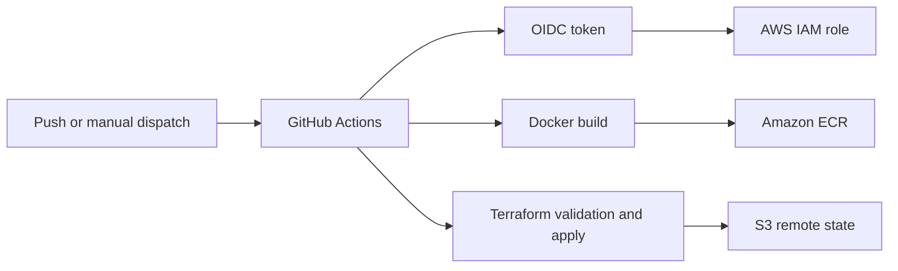

# AWS Terraform Infrastructure

A hands-on AWS delivery project combining Terraform, Docker, GitHub Actions and GitHub OIDC.

The repository demonstrates how cloud infrastructure and application delivery can be kept repeatable, traceable and free from long-lived AWS credentials in CI/CD.

## What is implemented

| Area | Evidence |
|---|---|
| Terraform state | S3 remote backend with native lockfile support |
| Reusable infrastructure | Secure S3 module with documented inputs, outputs and security defaults |
| Secure storage baseline | Bucket versioning, public-access blocking and Bucket Owner Enforced ownership |
| CI/CD authentication | GitHub Actions OIDC with short-lived IAM-role credentials |
| Terraform delivery | Format, init, validate, plan and apply workflow |
| Container delivery | Docker build and Amazon ECR publish workflow |
| Traceability | Environment and commit-SHA image tags |
| Environment structure | Implemented dev Terraform configuration plus a defined QA/prod extension path |

## Delivery flow



## Repository structure

```text
.github/workflows/     GitHub Actions: OIDC test, Terraform deploy, Docker → ECR
terraform/             Canonical AWS configuration and remote state
modules/               Reusable secure S3 module
environments/dev/      Runnable development-environment module composition
Dockerfile             Container image definition
app.py                 Python application entry point
```

## Security decisions

- GitHub Actions uses `id-token: write` and assumes AWS IAM roles instead of storing access keys.
- The Terraform state backend is remote; state files remain out of version control.
- The reusable S3 module enables versioning, blocks public access and enforces bucket ownership.
- Image tags include the commit SHA, giving a durable deployment reference.
- Terraform `moved` blocks preserve existing state addresses while the inline S3 resources move into the module.

## Validation

The Terraform workflow performs:

```text
terraform fmt → terraform init → terraform validate → terraform plan → terraform apply
```

The OIDC workflow verifies the assumed identity with `aws sts get-caller-identity`. The container workflow builds the image and publishes both environment and commit-SHA tags to ECR.

## Run locally

Canonical configuration:

```bash
cd terraform
terraform init
terraform validate
terraform plan
```

Development-environment composition:

```bash
cd environments/dev
terraform init
terraform validate
terraform plan -var-file=dev.tfvars
```

The two roots use different bucket names and separate state. Use AWS credentials with only the permissions required for the task. Never commit state, plans, credentials or local machine artifacts.

## Production-hardening next steps

- Pull-request plan output and review before applies
- Protected GitHub environments for QA and production
- Explicit rollback and image-retention policies
- Policy checks and cost estimation in CI
- Automated module tests and additional modules only when a stable reusable boundary exists

## Interview version

> I built this project to connect Terraform, Docker and GitHub Actions into a secure AWS delivery workflow. The key decision was OIDC, so GitHub assumes short-lived AWS roles instead of using stored credentials. I extracted the secure S3 baseline into a reusable module with explicit inputs and outputs, while Terraform moved blocks preserve the existing state. The pipeline validates Terraform, publishes traceable ECR image tags and keeps state remote and locked. The next production step is PR planning and protected environments.

## Status

Active hands-on Cloud & DevOps project. The implemented workflows, module and infrastructure are linked above; future production controls are clearly identified rather than presented as complete.
